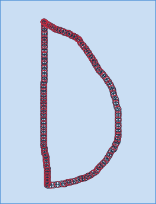

# TP : Chaînes de Markov cachées

***Auteur : BARCHID Sami***

Ce README contient les réponses des questions demandées lors de ce TP sur les chaînes de Markov.

## Modalités
- Dans le répertoire courant se trouvent les sources complétées du TP sur les chaînes de Markov cachées.
- Le fichier `gestures.xml` est le même que le fichier original, sauf qu'un pattern en plus a été ajouté (comme demandé à la question 9). La classe ajouté se nomme "**lune**" et ressemble à l'image ci-dessous. En gros, c'est un D majuscule... 

- L'exécution du code peut se faire via la commande suivante (lorsque l'on se positionne sur le répertoire racine du projet) : `java -jar markov.jar`

## Réponses aux questions du TP
Cette partie présente les réponses aux questions posées dans l'énoncé du TP.

#### Question 3
> "[...] Quels sont les défauts de la méthode d’extraction proposée?"

#### Question 4
> "Lisez et comprenez les méthodes `computeKmeansLearner` et `trainHMM` de `GestureClass`."

#### Question 7
> "La post-traiement permet de détecter les faux positifs: par exemple un geste tracé qui n’a rien à voir avec les différentes classes de gestes. Une première solution consiste à mettre un seuil sur la probabilité calculée. Une seconde solution consiste à calculer des caractéristiques globales sur le geste (distance entre premier point et dernier point par exemple) et ensuite déterminer si elles sont valides. Compte tenu des valeurs de probabilités la première solution n’est pas viable. Testez la seconde solution."

#### Question 8
> Jouez avec le nombre d’état cachés des chaînes de Markov, le pas de temps pour le ré-échantillionnage et le calcul des caractéristiques pour observer les résultats sur les performances de reconnaissance. Quelle est l’influence de ces différents paramètres, comment les optimiser? La méthode `TestAllExamples` de `HMM` peut aider à répondre à cette question.

